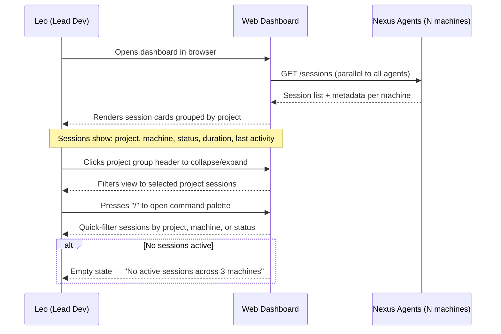
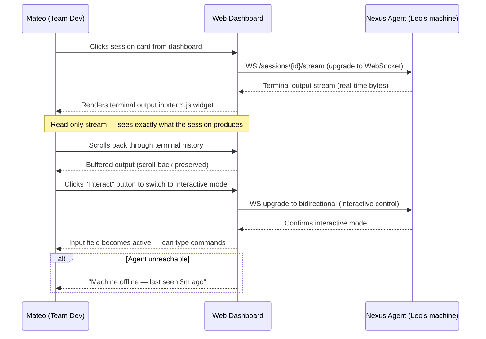
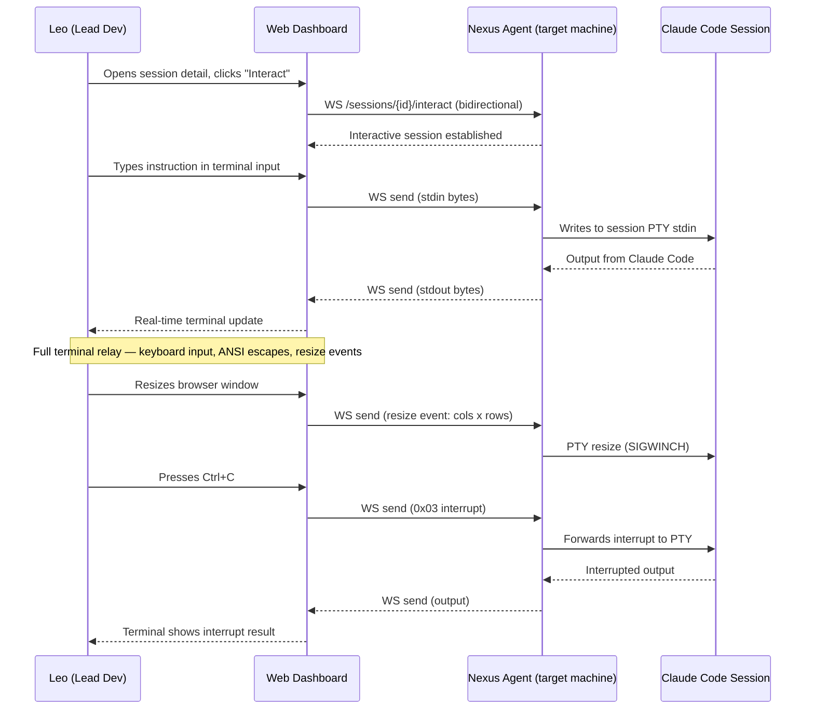
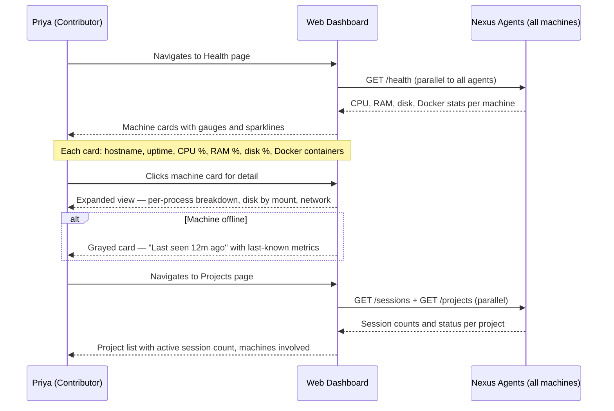
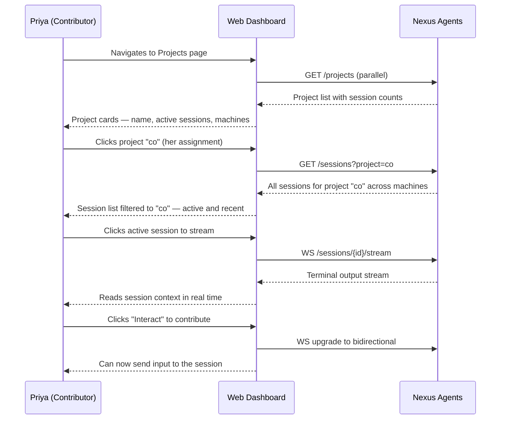

# Product Requirements Document — Nexus v2

> Generated: 2026-04-03
> Sources: scope-lock.md, user-stories.md, financial-projections.md, brand/
> Clarity Score: 9/10

---

## 1. Vision & Problem Statement

### Vision

A Bun-powered web dashboard that lets a small dev team see, stream, and interact with all their
Claude Code sessions across every machine — in real time, from any browser.

### Problem Statement

A team of 2-5 developers runs 10-20 concurrent Claude Code sessions across 3-5 machines connected
via Tailscale. Today, checking session state requires SSH-hopping between machines. There is no
single view of "what is every AI agent doing right now." Missed session outputs must be re-run.
Health problems (disk full, OOM) are discovered after they crater builds. Coordination happens
over Slack ("is that deploy done?") rather than through shared visibility.

**Quantified pain**: Each developer loses 50 minutes per day to multi-machine friction — 937.5
hours per year for a 3-person team at 250 working days.

### Differentiator

**Only tool that aggregates AI coding sessions across machines with a web dashboard.** No existing
tool does this. CCManager (github.com/kbwo/ccmanager) manages sessions within worktrees but has no
web UI, no multi-machine aggregation, no collaboration. GoTTY/Muxplex share terminals via web but
have no AI session awareness. Gemini Code Assist has team metrics but is single-instance SaaS.

Nexus v2 owns the "team AI session dashboard" category.

### Features to Steal

| Source | Pattern |
|--------|---------|
| **CCManager** | Session detection patterns, worktree-aware session handling, CLI ergonomics |
| **GoTTY** | WebSocket terminal relay architecture for browser-based terminal interaction |
| **Amp (Sourcegraph)** | Thread sharing and team context reuse patterns |

---

## 2. Target Users

### Personas

#### Leo — Lead Developer / Power User

| Field | Detail |
|-------|--------|
| **Role** | Lead developer, project owner of 14 T3 projects |
| **Machines** | 3-5 dev servers on Tailscale |
| **Daily sessions** | 5-10 concurrent Claude Code sessions |
| **Goals** | See all sessions at a glance; stream or take over any session from any machine; spot resource bottlenecks before they crater a build |
| **Pain points** | tmux-hops between machines to check state; no unified view; health problems discovered after the fact |
| **Technical comfort** | Power user — keyboard-first, lives in terminal, will customize keybindings |
| **Primary flows** | Dashboard overview, send input to sessions, settings management |

#### Mateo — Team Developer

| Field | Detail |
|-------|--------|
| **Role** | Full-stack engineer on the same Tailscale network |
| **Goals** | Watch Leo's sessions to learn patterns; send follow-up instructions without interrupting Leo; check project health across machines |
| **Pain points** | No visibility into sessions on other machines; asks Leo via Slack instead of seeing directly; cannot contribute to sessions started by teammates |
| **Technical comfort** | CLI-comfortable but prefers web UI for dashboards |
| **Primary flows** | Stream a session, send input, project context discovery |

#### Priya — Part-Time Contributor

| Field | Detail |
|-------|--------|
| **Role** | Contractor / part-time dev, limited hours per week |
| **Goals** | Find sessions relevant to her assigned projects; stream sessions to understand context before picking up work; check machine health to know if builds will be slow |
| **Pain points** | Joins mid-sprint with no context; wastes time asking teammates; unfamiliar with full machine topology |
| **Technical comfort** | Comfortable — prefers browser-based tools over raw terminal |
| **Primary flows** | Machine health check, project context discovery, session streaming |

### Common Trait

All users are developers who use Claude Code heavily and have machines on the same Tailscale
network. All need cross-machine session visibility.

---

## 3. Success Metrics

### Scale Target

| Timeframe | Users | Machines | Concurrent Sessions |
|-----------|------:|--------:|-------------------:|
| Year 1 | 2-5 | 3-5 | 10-20 |
| Year 3 | 2-5 | 8-10 | 30-50 |

**Not building for**: 100+ users, enterprise, or multi-team deployments.

### v2 Ship Criteria

The following four capabilities are mandatory. If any is missing, the release is not v2:

1. **See all active Claude Code sessions across all machines** — unified dashboard view
2. **Stream any session's output in real time** — WebSocket terminal relay
3. **Send input to any session (full interactive control)** — bidirectional terminal
4. **View machine health and project status** — CPU, RAM, disk, Docker per machine

### Productivity KPIs

| Metric | Baseline (no Nexus) | Target (with Nexus v2) | Improvement |
|--------|--------------------:|----------------------:|-----------:|
| Time to check session status | 10 min/day/dev (SSH) | 1 min/day/dev (dashboard) | 90% reduction |
| Context switching overhead | 15 min/day/dev | 4.5 min/day/dev | 70% reduction |
| Missed session outputs | 10 min/day/dev | 2 min/day/dev | 80% reduction |
| Manual health checks | 5 min/day/dev | 0.25 min/day/dev | 95% reduction |
| Coordination overhead | 10 min/day/dev | 4 min/day/dev | 60% reduction |
| **Total daily friction** | **50 min/day/dev** | **11.75 min/day/dev** | **76.5%** |

---

## 4. Functional Requirements

### 4.1 User Flows

#### Flow 1: Dashboard Overview (Leo)

> Maps to ship criterion #1: "See all active Claude Code sessions across all machines"



**Requirements:**
- REQ-DASH-1: Dashboard fetches sessions from all configured agents in parallel on page load
- REQ-DASH-2: Sessions are grouped by project with collapsible project headers
- REQ-DASH-3: Each session card displays: project name, machine hostname, status (active/idle/ended), duration, and last activity timestamp
- REQ-DASH-4: Command palette (triggered by "/") provides quick-filter by project, machine, or status
- REQ-DASH-5: Empty state displays "No active sessions across N machines" (where N is the count of reachable agents)

#### Flow 2: Stream a Session (Mateo)

> Maps to ship criterion #2: "Stream any session's output in real time"



**Requirements:**
- REQ-STREAM-1: Clicking a session card opens the session detail page with an xterm.js terminal widget
- REQ-STREAM-2: The terminal connects via WebSocket to the agent's `/sessions/{id}/stream` endpoint
- REQ-STREAM-3: Terminal output is rendered in real time as raw bytes (including ANSI escape sequences)
- REQ-STREAM-4: Scroll-back buffer preserves terminal history for review
- REQ-STREAM-5: "Interact" button upgrades the connection from read-only to bidirectional
- REQ-STREAM-6: If the agent is unreachable, display "Machine offline — last seen {duration} ago"

#### Flow 3: Send Input to a Session (Leo)

> Maps to ship criterion #3: "Send input to any session (full interactive control)"



**Requirements:**
- REQ-INTERACT-1: Interactive mode provides full bidirectional terminal relay (stdin, stdout, stderr)
- REQ-INTERACT-2: Keyboard input is forwarded as raw bytes, including control characters (Ctrl+C = 0x03)
- REQ-INTERACT-3: Browser window resize events propagate as PTY resize (SIGWINCH) to the remote session
- REQ-INTERACT-4: ANSI escape sequences are rendered correctly in the xterm.js widget
- REQ-INTERACT-5: Latency from keypress to screen update is under 100ms on the Tailscale network

#### Flow 4: Machine Health Check (Priya)

> Maps to ship criterion #4: "View machine health and project status"



**Requirements:**
- REQ-HEALTH-1: Health page fetches `/health` from all configured agents in parallel
- REQ-HEALTH-2: Each machine card displays: hostname, uptime, CPU %, RAM %, disk %, Docker container count
- REQ-HEALTH-3: Gauges and sparklines provide at-a-glance visualization of resource utilization
- REQ-HEALTH-4: Clicking a machine card expands to show per-process CPU/RAM, disk by mount point, and network stats
- REQ-HEALTH-5: Offline machines display as grayed cards with "Last seen {duration} ago" and last-known metric snapshot
- REQ-HEALTH-6: Projects page aggregates session counts and machine involvement per project

#### Flow 5: Project Context Discovery (Priya)

> Cross-cutting journey — onboarding to a project mid-sprint



**Requirements:**
- REQ-PROJECT-1: Projects page lists all projects with active session count and machine distribution
- REQ-PROJECT-2: Clicking a project filters to all sessions (active and recent) for that project across machines
- REQ-PROJECT-3: From a filtered project view, users can stream or interact with any session

### 4.2 Acceptance Criteria

| ID | Flow | Criterion |
|----|------|-----------|
| AC-1 | Dashboard Overview | Given 3 agents are online with 5 total sessions, when Leo opens the dashboard, then all 5 sessions render within 2 seconds grouped by project |
| AC-2 | Dashboard Overview | Given 0 sessions are active across 3 agents, when Leo opens the dashboard, then "No active sessions across 3 machines" is displayed |
| AC-3 | Dashboard Overview | Given sessions exist for 4 projects, when Leo presses "/" and types a project name, then only sessions for that project are visible |
| AC-4 | Stream Session | Given a session is active on Agent-A, when Mateo clicks the session card, then terminal output streams within 500ms of the WebSocket handshake |
| AC-5 | Stream Session | Given Mateo is streaming, when 200 lines of output arrive, then Mateo can scroll back to line 1 |
| AC-6 | Stream Session | Given Agent-A goes offline, when Mateo is streaming, then the UI displays "Machine offline — last seen {N}s ago" within 5 seconds |
| AC-7 | Send Input | Given Leo is in interactive mode, when Leo types "hello" and presses Enter, then "hello" appears in the remote session's stdin within 100ms |
| AC-8 | Send Input | Given Leo is in interactive mode, when Leo presses Ctrl+C, then 0x03 is sent to the remote PTY and the interrupt result renders |
| AC-9 | Send Input | Given Leo resizes the browser window to 120x40, then a SIGWINCH event sets the remote PTY to 120 columns x 40 rows |
| AC-10 | Health Check | Given 3 agents are online, when Priya opens the Health page, then 3 machine cards render with live CPU %, RAM %, and disk % |
| AC-11 | Health Check | Given Agent-B has been offline for 12 minutes, when Priya opens Health, then Agent-B shows a grayed card with "Last seen 12m ago" |
| AC-12 | Health Check | Given Agent-A reports 92% disk usage, then the disk gauge for Agent-A renders in warning color (yellow) |
| AC-13 | Project Discovery | Given project "co" has 2 active sessions across 2 machines, when Priya clicks "co" on Projects page, then both sessions are listed with machine labels |
| AC-14 | Project Discovery | Given Priya is viewing "co" sessions, when she clicks a session, then the session detail page opens with streaming terminal |

### 4.3 Page Inventory

| Page | Route | Purpose | Primary Persona | Key Elements |
|------|-------|---------|-----------------|-------------|
| Dashboard | `/` | Session overview and navigation hub | Leo | Session cards grouped by project, command palette, real-time status badges |
| Session Detail | `/session/{id}` | Stream and interact with a single session | Mateo, Leo | xterm.js terminal, stream/interact toggle, session metadata sidebar |
| Health | `/health` | Machine resource monitoring | Priya | Machine cards with gauges, sparklines, expandable per-process detail |
| Projects | `/projects` | Project overview with session counts | Priya | Project cards with active session count, machine distribution |
| Project Detail | `/projects/{name}` | Sessions filtered to one project | Priya, Mateo | Session list for one project across all machines |
| Settings | `/settings` | Agent configuration and preferences | Leo | Agent list, connection status, notification preferences |

---

## 5. Business Case

### Business Model

**Internal team tool. No revenue. No SaaS. No pricing.** Value is measured in developer
productivity, not revenue.

Potential future: open-source if the tool proves valuable to others. v2 is built for one
team's needs, not for distribution.

### 5.1 Development Investment

| Component | Hours | Cost ($100/hr) |
|-----------|------:|---------------:|
| Agent daemon (Bun, compiled binary) | 80 | $8,000 |
| Next.js web dashboard | 120 | $12,000 |
| Rust file watcher (carry forward) | 8 | $800 |
| Meeting-aware notifications | 24 | $2,400 |
| Credential pool management | 16 | $1,600 |
| SQLite analytics layer | 24 | $2,400 |
| Testing & QA | 40 | $4,000 |
| Integration & polish | 32 | $3,200 |
| **Total (raw)** | **344** | **$34,400** |
| **Total (AI-assisted, 25-30% reduction)** | **~260** | **~$26,000** |

Calendar time: 6-10 weeks at 40-60 hours/week effective development.

### 5.2 Total Cost of Ownership (3-Year)

| Period | Development | Infrastructure | Maintenance | Total |
|--------|----------:|-------------:|-----------:|------:|
| Year 0 (build) | $26,000 | $0 | $0 | $26,000 |
| Year 1 (post-launch) | $0 | $120 | $17,400 | $17,520 |
| Year 2 | $0 | $120 | $9,600 | $9,720 |
| Year 3 | $0 | $120 | $9,600 | $9,720 |
| **3-Year Total** | **$26,000** | **$360** | **$36,600** | **$62,960** |

Infrastructure is negligible ($0-20/month — Tailscale free tier, SQLite embedded, systemd/launchd
native). The dominant cost is human time.

### 5.3 ROI Analysis

| Metric | Value |
|--------|-------|
| Annual productivity gain (3 devs, 717 hrs saved) | $71,700 |
| Payback period | 4.3 months |
| Year 1 net value | $54,180 |
| 3-year net value | $152,140 |
| **3-year ROI** | **342%** |

### Sensitivity Analysis

| Scenario | Team Size | Daily Friction | Payback | 3-Year ROI |
|----------|----------:|---------------:|--------:|----------:|
| Optimistic | 5 devs | 60 min/day | 2.5 months | 595% |
| Base case | 3 devs | 50 min/day | 4.3 months | 342% |
| Conservative | 2 devs | 30 min/day | 12.5 months | 95% |
| Pessimistic | 2 devs | 15 min/day | 25 months | -1% |

Even in the conservative case, Nexus v2 pays for itself within the first year.

### 5.4 Build vs. Buy

| Option | Cost | Fit |
|--------|------|-----|
| **Build Nexus v2** | ~$63K over 3 years | Purpose-built for Claude Code sessions, multi-machine, team-aware |
| CCManager (open source) | $0 + integration | Single-machine only, no web UI, no team features |
| GoTTY + custom glue | $5K-10K | Terminal sharing only, no session awareness |
| Do nothing | $0 direct, ~$94K/yr lost productivity | Friction compounds annually |

**No existing tool solves this problem.** Build is the only viable path.

---

## 6. Design Language

### Brand Identity

- **Product name**: Nexus
- **Tagline**: See every session. Control any machine.
- **Voice**: Direct, precise, utilitarian, confident, fast
- **Tone register**: Technical-casual — like talking to a sharp colleague
- **Anti-patterns**: No marketing copy, no enterprise jargon, no consumer app cheerfulness, no apologetic UX

### 6.1 Color System

Dark-first palette. Near-black backgrounds with high-contrast foreground text. Status colors are
the primary information channel.

| Role | Token | Hex | Usage |
|------|-------|-----|-------|
| Background | `--color-bg` | `#0A0A0B` | App background, deepest layer |
| Surface | `--color-surface` | `#111113` | Cards, panels, elevated containers |
| Surface Raised | `--color-surface-raised` | `#1A1A1D` | Hover states, active panels, dropdowns |
| Surface Overlay | `--color-surface-overlay` | `#222225` | Overlays, command palette backdrop |
| Border | `--color-border` | `#27272A` | Panel dividers, card borders |
| Border Bright | `--color-border-bright` | `#3F3F46` | Focused inputs, active borders |
| Border Focus | `--color-border-focus` | `#3B82F6` | Keyboard focus ring |
| Foreground | `--color-fg` | `#FAFAFA` | Primary text, headings |
| Foreground Dim | `--color-fg-dim` | `#A1A1AA` | Body text, descriptions |
| Foreground Muted | `--color-fg-muted` | `#71717A` | Timestamps, metadata, secondary info |
| Foreground Ghost | `--color-fg-ghost` | `#52525B` | Disabled text, placeholders |
| Primary | `--color-primary` | `#3B82F6` | Active sessions, primary actions, links |
| Primary Hover | `--color-primary-hover` | `#2563EB` | Hovered primary elements |
| Success | `--color-success` | `#22C55E` | Healthy, connected, running |
| Warning | `--color-warning` | `#EAB308` | Degraded, slow, needs attention |
| Error | `--color-error` | `#EF4444` | Failed, disconnected, critical |

**Design rationale:**
- Near-black (`#0A0A0B`) over pure black reduces eye strain on OLED/LCD
- Zinc-based neutrals (blue-gray) match terminal emulator aesthetics
- Blue primary avoids competing with green/red/yellow status semantics
- Status colors are saturated — must pop at a glance in dense layouts

### 6.2 Typography

| Purpose | Family | Token |
|---------|--------|-------|
| Display & headings | Geist Sans | `--font-heading` |
| Body text & UI copy | Geist Sans | `--font-body` |
| Data, timestamps, terminal output | Geist Mono | `--font-code` |

**Type scale** (1.25 modular ratio):

| Name | Size | Rem | Usage |
|------|-----:|-----|-------|
| Display | 36px | 2.25rem | Page titles, hero numbers |
| H1 | 30px | 1.875rem | Section headers |
| H2 | 24px | 1.5rem | Panel titles |
| H3 | 20px | 1.25rem | Card headers |
| H4 | 18px | 1.125rem | Sub-sections |
| Body | 16px | 1rem | Default text |
| Small | 14px | 0.875rem | Metadata, timestamps |
| XS | 12px | 0.75rem | Badges, micro-labels |

### 6.3 UI Specifications

#### Icons

**Library**: Phosphor Icons (phosphoricons.com) — line weight variant, 1.5px stroke, MIT license.

| Size | Usage |
|------|-------|
| 16px | Inline status dots, badge icons, table row icons |
| 20px | Navigation items, list items, button icons (default) |
| 24px | Panel headers, section markers, emphasis |
| 32px | Empty states, hero metrics, large status indicators |

**Key icon mapping:**

| Concept | Phosphor Icon |
|---------|--------------|
| Active session | `Terminal` |
| Idle session | `TerminalWindow` |
| Machine/Agent | `Desktop` |
| Health | `Heartbeat` |
| CPU | `Cpu` |
| Memory | `Memory` |
| Disk | `HardDrive` |
| Streaming (read-only) | `Eye` |
| Interactive control | `PencilLine` |
| Connected | `PlugsConnected` |
| Disconnected | `Plugs` |
| Settings | `GearSix` |
| Search | `MagnifyingGlass` |

#### Design Principles

1. **Density over whitespace** — Pack information tight. Developers read dense data layouts daily.
2. **Status at a glance** — Color-coded dots, inline badges, sparklines. No hover-to-reveal.
3. **Keyboard-first, mouse-welcome** — Every action reachable by keyboard. Vim-like navigation (j/k, /).
4. **No ceremony** — Zero onboarding flows, no welcome modals. Dashboard loads and shows data immediately.
5. **Terminal heritage** — Monospace data, dark backgrounds, high contrast, compact layouts.

#### Spacing

4px base unit. Tokens from `--space-0` (0) through `--space-24` (96px).

#### Border Radius

| Token | Size | Usage |
|-------|------|-------|
| `--radius-sm` | 4px | Badges, small chips |
| `--radius-md` | 6px | Buttons, inputs |
| `--radius-lg` | 8px | Cards, panels |
| `--radius-xl` | 12px | Modals, large containers |
| `--radius-full` | 9999px | Pills, status dots |

#### Transitions

Fast, no-nonsense: 100ms (fast), 150ms (base), 200ms (slow). Easing: `ease`.

#### Design token file

Full CSS custom property definitions: `docs/plan/v2/brand/tokens.css`

---

## 7. Technical Architecture

### Stack

| Layer | Technology | Notes |
|-------|-----------|-------|
| Agent daemon | Bun (compiled to single binary) | Per-machine, runs as systemd/launchd service |
| Web dashboard | Next.js with Server Actions | Central instance, team accesses via browser |
| File watcher | Rust `notify` crate binary | Carried from v1, communicates with Bun agent via IPC |
| Database | SQLite (Bun native) | Per-agent + central, embedded, zero infrastructure |
| Real-time transport | HTTP + WebSocket | No gRPC, no protobuf, no tRPC |
| Terminal rendering | xterm.js | Browser-side terminal emulation |
| Network | Tailscale mesh | No public internet exposure |
| Auth | Tailscale ACLs | No custom authentication system |
| Session detection | `nexus-register` hook | Claude Code pre-tool hooks (carried from v1) |

### Topology

```
┌─────────────────────────────────────────────────────────────┐
│  Tailscale Mesh Network (private)                           │
│                                                             │
│  ┌──────────────┐  ┌──────────────┐  ┌──────────────┐      │
│  │  Machine A    │  │  Machine B    │  │  Machine C    │     │
│  │  nexus-agent  │  │  nexus-agent  │  │  nexus-agent  │     │
│  │  (Bun binary) │  │  (Bun binary) │  │  (Bun binary) │     │
│  │  + Rust FW    │  │  + Rust FW    │  │  + Rust FW    │     │
│  │  + SQLite     │  │  + SQLite     │  │  + SQLite     │     │
│  │  :7400        │  │  :7400        │  │  :7400        │     │
│  └──────┬───────┘  └──────┬───────┘  └──────┬───────┘      │
│         │                  │                  │              │
│         └──────────┬───────┴──────────┬──────┘              │
│                    │                  │                      │
│              ┌─────┴──────────────────┴─────┐               │
│              │     Next.js Dashboard         │               │
│              │     (Server Actions)          │               │
│              │     + SQLite (central)        │               │
│              │     :3000                     │               │
│              └──────────────────────────────┘               │
└─────────────────────────────────────────────────────────────┘
```

### Agent API Surface

| Endpoint | Method | Purpose |
|----------|--------|---------|
| `/sessions` | GET | List all sessions on this machine |
| `/sessions/{id}` | GET | Session detail + metadata |
| `/sessions/{id}/stream` | WS | Read-only terminal output stream |
| `/sessions/{id}/interact` | WS | Bidirectional terminal relay |
| `/health` | GET | CPU, RAM, disk, Docker stats |
| `/projects` | GET | Projects with session counts |

### Communication Pattern

- Dashboard to agents: HTTP GET for data, WebSocket for terminal streaming
- Agents to file watcher: IPC (subprocess communication with Rust binary)
- Session detection: `nexus-register` hook fires on Claude Code start/stop/heartbeat
- Agent discovery: `~/.config/nexus/agents.toml` (same as v1, hot-reloaded)

### Data Model

Per-agent SQLite stores session events, health snapshots, and notification queue. Central
dashboard SQLite stores aggregated analytics and user preferences.

No migration from Rust v1 SQLite data — clean start.

[NOT AVAILABLE — run `/plan:infra` for detailed infrastructure plan, Terraform stubs, and
deployment topology]

---

## 8. Scope & Constraints

### 8.1 In Scope

| Category | Items |
|----------|-------|
| **Agent daemon** | Session detection, health monitoring, WebSocket terminal relay, SQLite storage, Bun compiled binary |
| **Web dashboard** | Next.js with Server Actions, real-time session streaming, interactive terminal, project and health views |
| **Rust file watcher** | `notify`-based binary carried from v1, IPC integration with Bun agent |
| **Notifications** | Meeting-aware queuing (ported from Rust) |
| **Credentials** | Credential pool management across sessions (ported from Rust) |
| **Analytics** | SQLite analytics layer, session and notification data |
| **Deployment** | systemd (Linux), launchd (macOS) for agents; Vercel or self-hosted for dashboard |

### 8.2 Out of Scope (v2 Won't-Do)

| Item | Rationale |
|------|-----------|
| TUI client | Killed — 46K-line ratatui TUI retired. Web dashboard is the only interface. |
| tRPC | Dashboard uses Server Actions. Agent API uses HTTP/WebSocket. |
| gRPC / Protobuf | Replaced by JSON APIs. gRPC was chosen for Rust ergonomics, not the problem domain. |
| Rust (except file watcher) | The `notify`-based binary stays. Everything else moves to Bun/TS. |
| Public access | Tailscale-only. No auth system beyond Tailscale ACLs. |
| Plugin system | Direct integration only. |
| Multi-tenant | Single team, single deployment. |
| Mobile app | Not building for mobile. |
| SaaS / public hosting | Internal tool only. |
| AI model routing / prompt management | Out of domain. |
| IDE integrations | No VS Code or JetBrains plugins. |
| Porting 662 Rust tests | New test suite for new architecture. |
| Migrating Rust SQLite data | Clean start, no data migration. |

### 8.3 Hard Constraints

| Constraint | Detail |
|------------|--------|
| Runtime | Bun (compiled single binary for agent daemon) |
| Dashboard | Next.js with Server Actions |
| Database | SQLite (Bun native, per-agent + central) |
| Network | Tailscale mesh — no public internet exposure |
| Auth | Tailscale ACLs — no custom auth system |
| File watching | Rust `notify` crate binary — Bun agent communicates via IPC |
| Communication | HTTP + WebSocket (no gRPC, no protobuf) |
| Deploy | systemd (Linux), launchd (macOS) for agents; Vercel or self-hosted for dashboard |
| Existing data | No migration of Rust SQLite data — clean start |
| Session detection | Carry forward `nexus-register` hook pattern (CC pre-tool hooks) |

---

## 9. Timeline & Risk

### Timeline

No external deadline. Internal tool built at own pace.

**Phase preference**: Incremental — get the agent daemon + basic dashboard working first, add
collaboration features in parallel.

**Estimated build time**: 260 AI-assisted hours / 6-10 calendar weeks.

### Milestone Mapping

| Milestone | Estimated Hours | Deliverable |
|-----------|---------------:|-------------|
| Agent daemon MVP | 80 | Session detection, health endpoint, WebSocket relay, SQLite |
| Dashboard MVP | 120 | Session list, streaming, interactive terminal, health view |
| Rust file watcher integration | 8 | IPC bridge from Bun agent to Rust `notify` binary |
| Notification system | 24 | Meeting-aware queuing ported from Rust |
| Credential pool | 16 | Shared credential management ported from Rust |
| Analytics layer | 24 | SQLite schema, session/notification queries |
| Testing & QA | 40 | New test suite covering all 4 ship criteria |
| Integration & polish | 32 | Cross-machine testing, service configs, edge cases |

### Risk Factors

| Risk | Impact | Probability | Mitigation |
|------|--------|-------------|------------|
| Bun instability (young runtime) | Medium | Low | Can fall back to Node.js; Bun API is Node-compatible |
| Scope creep during build | High | Medium | Scope lock enforced; 4 must-do features only |
| Team shrinks to 1 developer | Low | Low | ROI weakens but tool still valuable for solo multi-machine use |
| Tailscale pricing changes | Negligible | Very Low | Free tier covers 100 devices; 3-5 machines is well within limit |
| WebSocket terminal relay complexity | Medium | Medium | GoTTY patterns well-documented; incremental delivery |

---

## 10. Route Architecture

[NOT AVAILABLE — run `/plan:routes docs/plan/v2` to generate route inventory with action map
and E2E coverage gaps]

---

## 11. Infrastructure Plan

[NOT AVAILABLE — run `/plan:infra docs/plan/v2` to generate cloud infrastructure mapping,
cost estimates, and deployment topology]

---

## Appendix A: Artifact Provenance

| PRD Section | Source Artifact | Lock Status |
|-------------|----------------|-------------|
| 1. Vision & Problem Statement | `scope-lock.md` | Locked |
| 2. Target Users | `scope-lock.md` + `user-stories.md` | Locked |
| 3. Success Metrics | `scope-lock.md` + `financial-projections.md` | Locked |
| 4. Functional Requirements | `user-stories.md` + `wireframes/` | Locked |
| 5. Business Case | `financial-projections.md` | Locked |
| 6. Design Language | `brand/` (brand-identity.md, icon-style.md, tokens.css) | Locked |
| 7. Technical Architecture | `scope-lock.md` (hard constraints) | Locked (partial) |
| 8. Scope & Constraints | `scope-lock.md` | Locked |
| 9. Timeline & Risk | `scope-lock.md` + `financial-projections.md` | Locked |
| 10. Route Architecture | Not available | Missing |
| 11. Infrastructure Plan | Not available | Missing |
