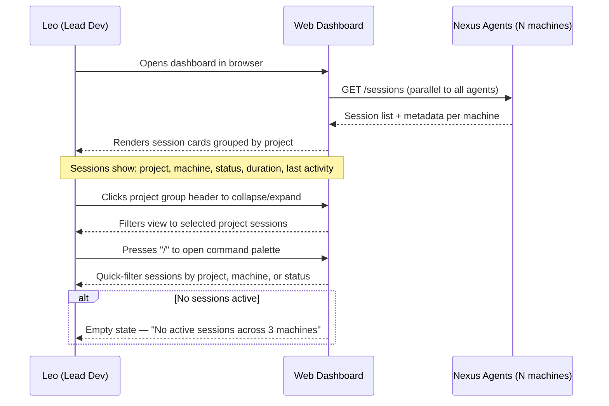
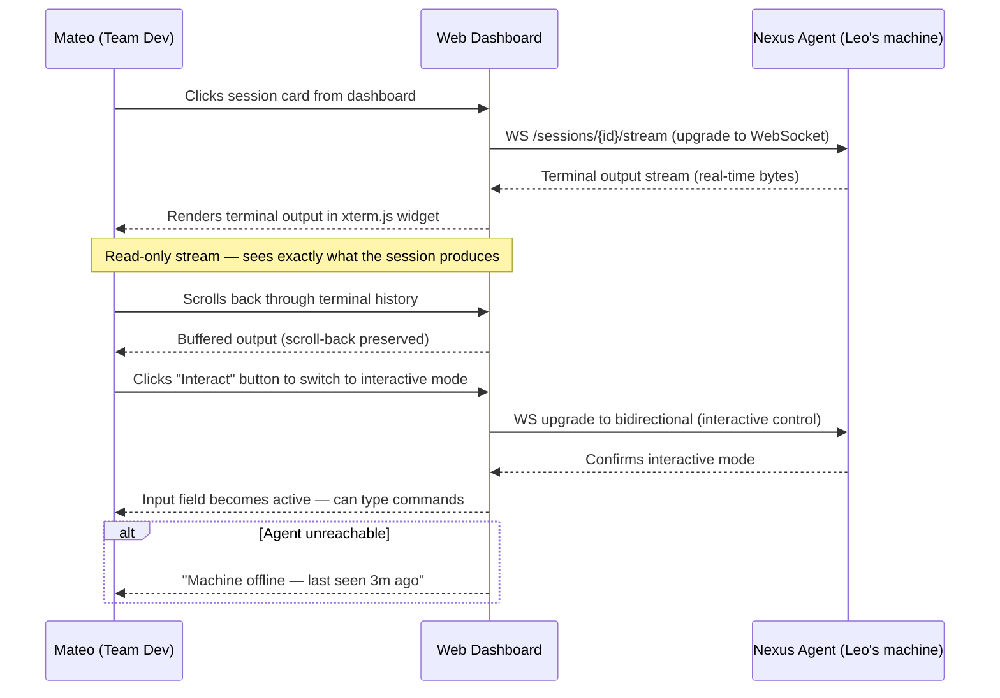
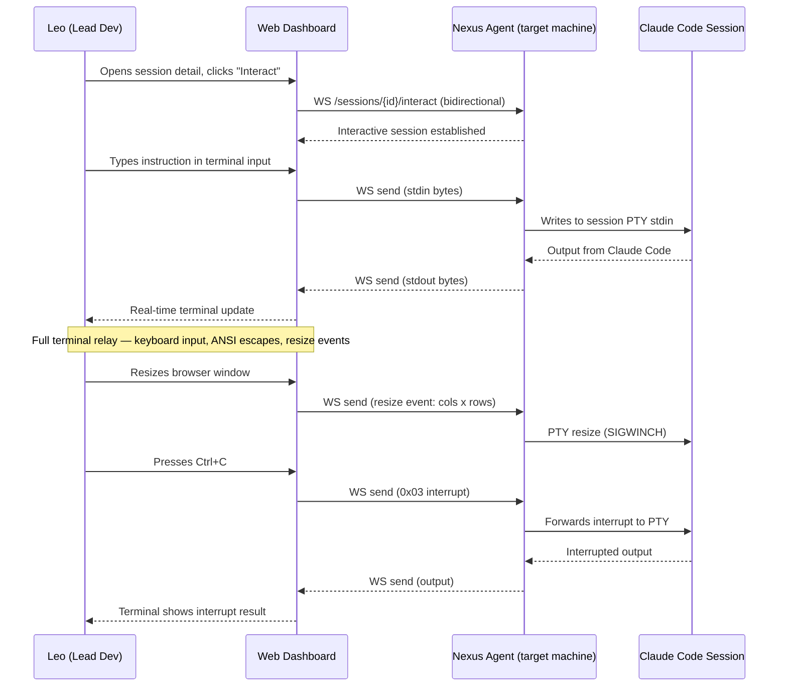
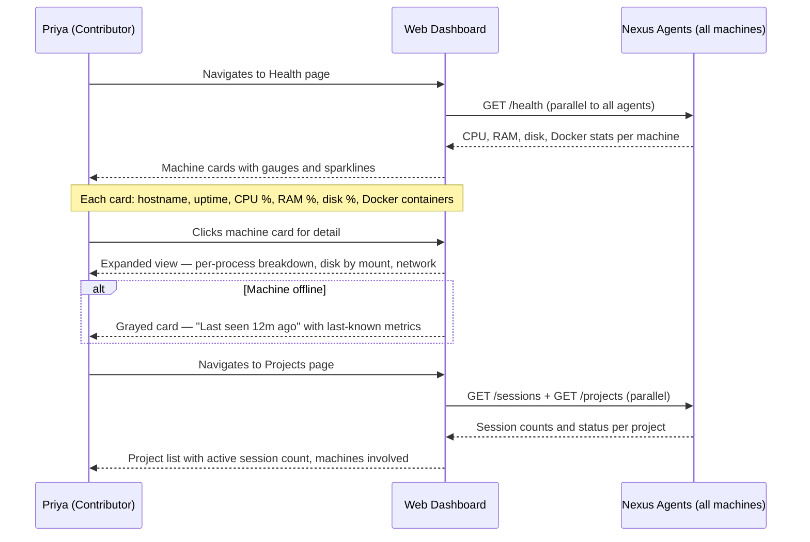
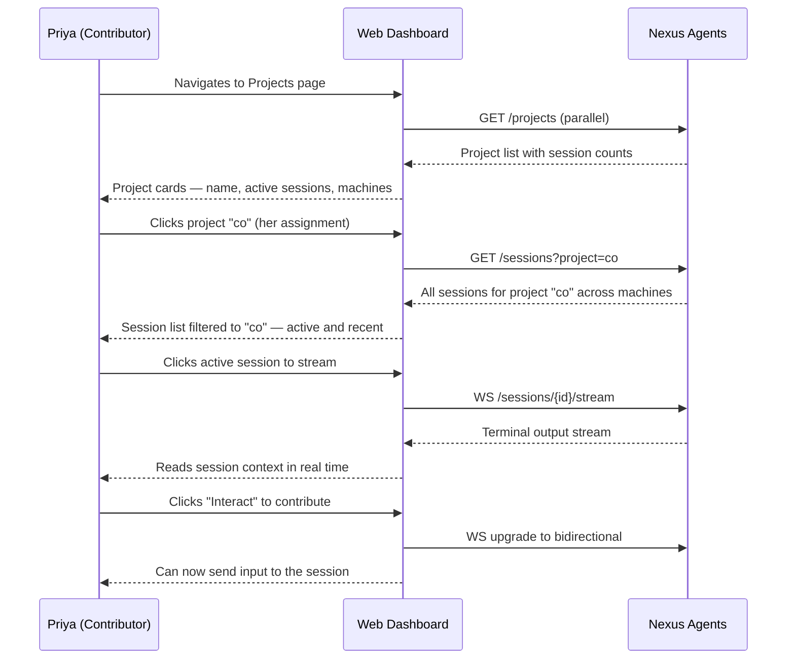

# User Stories — Nexus v2

> Generated: 2026-04-03
> Source: docs/plan/v2/scope-lock.md

---

## Personas

### 1. Leo — Lead Developer / Power User

| Field | Detail |
|-------|--------|
| **Name** | Leo |
| **Role** | Lead developer, project owner of 14 T3 projects |
| **Goals** | See all active Claude Code sessions across 3-5 machines at a glance; stream or take over any session from any machine without SSH; spot resource bottlenecks before they crater a build |
| **Pain Points** | Currently tmux-hops between machines to check session state; no single view of "what is every AI agent doing right now"; health problems (disk full, OOM) discovered after the fact |
| **Technical Comfort** | Power user — keyboard-first, lives in terminal, will customize keybindings |

### 2. Mateo — Team Developer

| Field | Detail |
|-------|--------|
| **Name** | Mateo |
| **Role** | Full-stack engineer on the same Tailscale network |
| **Goals** | Watch Leo's sessions to learn patterns; send follow-up instructions to a session Leo started without interrupting him; check project health across the team's machines |
| **Pain Points** | Has no visibility into sessions on other machines; asks Leo "is that deploy done?" via Slack instead of seeing it directly; can't resume or contribute to sessions started by teammates |
| **Technical Comfort** | Comfortable — uses CLI daily but prefers a web UI for dashboards |

### 3. Priya — Part-Time Contributor

| Field | Detail |
|-------|--------|
| **Name** | Priya |
| **Role** | Contractor / part-time dev, limited hours per week |
| **Goals** | Quickly find which sessions are relevant to her assigned projects; stream a session to understand context before picking up work; see machine health to know if her builds will be slow |
| **Pain Points** | Joins mid-sprint with no context on what sessions ran; wastes time asking teammates what happened; unfamiliar with the full machine topology |
| **Technical Comfort** | Comfortable — prefers browser-based tools over raw terminal |

---

## User Flows

### Flow 1: Dashboard Overview (Leo)

> v2 Must-Do journey #1 — "See all active Claude Code sessions across all machines"

### Flow 2: Stream a Session (Mateo)

> v2 Must-Do journey #2 — "Stream any session's output in real time"

### Flow 3: Send Input to a Session (Leo)

> v2 Must-Do journey #3 — "Send input to any session (full interactive control)"

### Flow 4: Machine Health Check (Priya)

> v2 Must-Do journey #4 — "View machine health and project status"

### Flow 5: Project Context Discovery (Priya)

> Cross-cutting journey — Priya onboards to a project mid-sprint

---

## Page Inventory

| Flow Step | Wireframe Page | Primary Persona |
|-----------|---------------|-----------------|
| Entry point / session overview | `index.html` (Dashboard) | Leo |
| Session detail + stream + interact | `pages/session.html` | Mateo, Leo |
| Machine health overview | `pages/health.html` | Priya |
| Project list + filtering | `pages/projects.html` | Priya |
| Project detail (sessions for one project) | `pages/project-detail.html` | Priya, Mateo |
| Settings (agent config, preferences) | `pages/settings.html` | Leo |

---

## Wireframes

Wireframe prototype at: `docs/plan/v2/wireframes/`

- `index.html` — Dashboard (navigation hub + session overview)
- `pages/session.html` — Session detail with terminal stream
- `pages/health.html` — Machine health monitoring
- `pages/projects.html` — Project overview
- `pages/project-detail.html` — Single project session list
- `pages/settings.html` — Agent configuration
- `styles.css` — Shared styles, dark mode, responsive breakpoints
